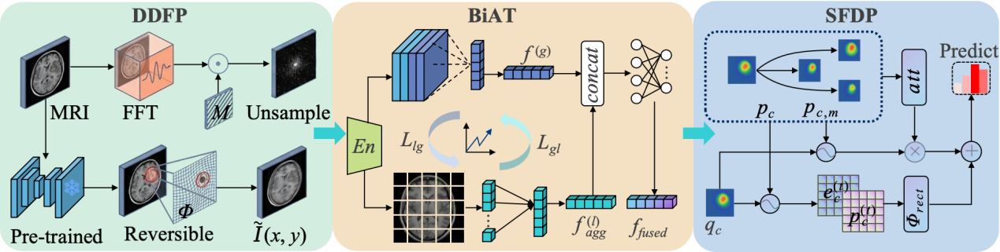

<p align="center">
  
</p>

<h1 align="center">PSD-Few: Physical-Constraints and Self-Distillation for Few-Shot Brain MRI Dual-Layer Prototype Diagnosis</h1>

<p align="center">
  <a href="https://www.python.org/downloads/release/python-390/"></a>
  <a href="https://pytorch.org/"></a>
</p>

<p align="center">
  <b>Physical-constraints and self-distillation for few-shot dual-layer prototype brain MRI diagnosis.</b><br>
  Achieves <b>80.15%</b> 5-way 1-shot and <b>90.78%</b> 5-way 5-shot accuracy on Brain44,<br>
  and <b>72.41%</b> 5-way 1-shot on miniImageNet, outperforming all SOTA baselines.
</p>

---

## Overview

Few-shot brain MRI diagnosis faces three fundamental challenges: (1) augmented samples that fail to reproduce the physical MRI acquisition process, (2) unbalanced local/global feature semantics during embedding optimization, and (3) static single-point prototypes that cannot capture complex intra-class structures. We propose **PSD-Few**, a framework that integrates three pluggable modules:

| Module | Code Name | Role |
|--------|-----------|------|
| **DEIP** | `models/deip.py` | Differentiable imaging physics-driven data prior enhancement: K-space undersampling , motion artifacts, and lesion-centered deformation; the constraint parameters are learnable and optimized with Gumbel-Softmax sampling |
| **BiAT** | `models/biat.py` | Attention-based local/global fusion with bidirectional self-distillation |
| **SFDP** | `models/sfdp.py` | Self-calibrating dual-layer prototypes with differentiable rectification  |

Experimental evaluations demonstrate:
- **80.15%** / **90.78%** 5-way 1-shot / 5-shot on **Brain44**
- **62.34%** / **77.32%** 3-way 1-shot / 5-shot on **Brain15**
- **72.41%** / **85.10%** 5-way 1-shot / 5-shot on **miniImageNet**

---

## Installation

```bash
git clone https://github.com/CV-Med/PSD-Few.git
cd PSD-Few

pip install -r requirements.txt
```

**Requirements:** Python 3.9+, PyTorch 2.0+, CUDA-capable GPU (recommended)

Key dependencies:

| Package | Version | Purpose |
|---------|---------|---------|
| `torch` | ≥ 2.0.0 | Deep learning framework |
| `torchvision` | ≥ 0.15.0 | Model zoo & image transforms |
| `numpy` | ≥ 1.22.0 | Numerical operations |
| `Pillow` | ≥ 9.4.0 | Image I/O |
| `opencv-python` | ≥ 4.8.0 | Grad-CAM visualization (tools) |
| `tqdm` | ≥ 4.64.0 | Training progress bars |
| `pyyaml` | ≥ 6.0 | Config file parsing |
| `matplotlib` | ≥ 3.6.0 | Visualization |

---

## Dataset Preparation

### Supported Datasets

| Dataset | Classes | Split (category-level) | DEIP | Source |
|---------|---------|------------------------|------|--------|
| **Brain44** | 44 tumor subtypes | 7:2:1 train/val/test | On | [Kaggle](https://www.kaggle.com/datasets/fernando2rad/brain-tumor-mri-images-44c) |
| **Brain15** | 15 tumor classes | 7:2:1 train/val/test | On | [Kaggle](https://www.kaggle.com/datasets/hellojahid/brain-tumor-classification-15-classes) |
| **miniImageNet** | 100 classes | 7:2:1 train/val/test | Off (MRI-specific) | [Kaggle](https://www.kaggle.com/datasets/arjunashok33/miniimagenet) · [split tools](https://github.com/yaoyao-liu/mini-imagenet-tools) |

### Data Structure

```
PSD-Few/
├── miniimagenet/
│   ├── train/class_0/*.jpg
│   ├── val/class_1/*.jpg
│   └── test/class_2/*.jpg
├── archive_44/           # Brain44
│   ├── train/<subtype>/*.png
│   └── ...
└── archive_15/           # Brain15
```

Download links are provided in each dataset directory (`download.txt`). When no pre-split layout exists, classes are partitioned automatically as shown above.

### Image Preprocessing and Data Split

| Dataset | Input size | Preprocessing | Split |
|---------|-----------|---------------|-------|
| **Brain44** | 224×224 | Resize to 1.15×, random crop with horizontal flip & color jitter (train) or center crop (val/test), ImageNet normalization | 7:2:1 category-level |
| **Brain15** | 224×224 | Resize to 1.15×, random crop with horizontal flip & color jitter (train) or center crop (val/test), ImageNet normalization | 7:2:1 category-level |
| **miniImageNet** | 84×84 | Resize to 1.15×, random crop with horizontal flip & color jitter (train) or center crop (val/test), ImageNet normalization | 7:2:1 category-level |

---

## Usage

```bash
# Train on miniImageNet (200 epochs, 200 episodes/epoch, Adam)
python run.py --mode train --dataset miniimagenet

# Evaluate 5-way (1-shot and 5-shot) under 5 seeds on Brain44
python run.py --mode test --dataset archive_44 --n_way 5

# Evaluate 3-way on Brain15
python run.py --mode test --dataset archive_15 --n_way 3

# Systematic module ablation (DEIP / BiAT / SFDP)
python run.py --mode ablation --dataset archive_44
```

| Argument | Default | Description |
|----------|---------|-------------|
| `--mode` | `train` | `train`, `test`, `eval`, or `ablation` |
| `--config` | `configs/config.yaml` | Path to YAML configuration |
| `--dataset` | `miniimagenet` | `miniimagenet`, `archive_44`, or `archive_15` |
| `--n_way` | from config | N-way evaluation (e.g. `5` or `3`) |
| `--epochs` | from config | Override training epochs |
| `--seeds` | from config | Number of evaluation seeds |
| `--ckpt` | `weights/best_checkpoint.pth` | Checkpoint to evaluate |


### Visualization Tools

```bash
# Global confusion matrix (Fig.9)
python tools/confusion_matrix.py --dataset archive_44 --ckpt weights/best_checkpoint.pth

# Grad-CAM attention heatmaps (Fig.11)
python tools/gradcam.py --dataset archive_44 --ckpt weights/best_checkpoint.pth
```

---

## Results

**Summary:** PSD-Few outperforms all compared methods on both brain MRI datasets and miniImageNet, with gains significant at p < 0.001 (paired t-test over 500 pooled episodes).

### Table 1: 5-way Few-Shot Classification (%)

| Method | Params. | miniImageNet 1-shot | miniImageNet 5-shot | Brain44 1-shot | Brain44 5-shot |
|--------|---------|:---:|:---:|:---:|:---:|
| FRN | 12.42M | 66.45±0.19 | 82.83±0.13 | 71.40±0.35 | 83.95±0.27 |
| HOT | 36.50M | 66.24±0.53 | 82.62±0.78 | 70.25±0.48 | 83.10±0.39 |
| MergedNET | 37.40M | 68.05±0.24 | 80.40±0.26 | 72.30±0.42 | 84.25±0.31 |
| QSFormer | 40.16M | 65.24±0.28 | 79.96±0.20 | 69.80±0.40 | 82.95±0.28 |
| MetaDiff | 12.40M | 64.99±0.77 | 81.21±0.56 | 69.10±0.51 | 82.40±0.36 |
| AMPL | 22.00M | 68.38±0.84 | 82.42±0.53 | 73.45±0.49 | 85.20±0.37 |
| SRE-ProtoNet | 13.66M | 68.73±0.43 | 84.31±0.29 | 74.15±0.41 | 86.05±0.33 |
| MSENet | 16.58M | 66.57±0.36 | 84.42±0.31 | 72.80±0.39 | 85.65±0.29 |
| **PSD-Few** | **14.47M** | **72.41±0.23** | **85.10±0.21** | **80.15±0.32** | **90.78±0.43** |

### Table 2: 3-way Few-Shot Classification (%)

| Method | Params. | Brain44 1-shot | Brain44 5-shot | Brain15 1-shot | Brain15 5-shot |
|--------|---------|:---:|:---:|:---:|:---:|
| FRN | 12.42M | 79.52±0.41 | 87.85±0.30 | 53.80±0.45 | 69.80±0.35 |
| HOT | 36.50M | 78.25±0.55 | 87.10±0.42 | 54.10±0.52 | 70.10±0.40 |
| MergedNET | 37.40M | 80.30±0.45 | 88.50±0.33 | 54.90±0.48 | 70.45±0.36 |
| QSFormer | 40.16M | 77.90±0.38 | 86.85±0.25 | 52.50±0.42 | 68.90±0.31 |
| MetaDiff | 12.40M | 77.15±0.58 | 86.40±0.40 | 51.80±0.55 | 68.40±0.38 |
| AMPL | 22.00M | 81.65±0.52 | 89.25±0.39 | 56.10±0.50 | 71.80±0.40 |
| SRE-ProtoNet | 13.66M | 82.45±0.46 | 90.12±0.35 | 56.80±0.44 | 72.15±0.36 |
| MSENet | 16.58M | 80.85±0.42 | 89.65±0.32 | 55.45±0.46 | 71.50±0.33 |
| **PSD-Few** | **14.47M** | **88.30±0.25** | **94.92±0.22** | **62.34±0.35** | **77.32±0.45** |

All results reported as mean ± 95% CI over 500 pooled test episodes (5 seeds × 100 episodes). **Bold** = best result.

### Table 3: Ablation Study on Brain44 (5-way 1-shot)

| No. | DEIP | BiAT | SFDP | Accuracy (%) |
|:---:|:---:|:---:|:---:|:---:|
| 1 | ✓ | | | 73.45±0.41 |
| 2 | | ✓ | | 74.10±0.39 |
| 3 | | | ✓ | 75.25±0.36 |
| 4 | ✓ | ✓ | | 76.80±0.35 |
| 5 | | ✓ | ✓ | 78.55±0.33 |
| 6 | ✓ | | ✓ | 77.90±0.34 |
| **7** | ✓ | ✓ | ✓ | **80.15±0.32** |

SFDP provides the largest gain; the three modules act complementarily.

---

## Hyperparameters

| Training Parameter | Value |
|--------------------|-------|
| Optimizer | Adam |
| Learning rate | 1×10⁻³ |
| Epochs | 200 |
| Training episodes / epoch | 200 |
| Validation / test episodes | 100 |
| Query size | 15 |
| Evaluation seeds | 5 |
| Gradient clip | 1.0 |

| Module | Parameter | Value |
|--------|-----------|-------|
| Loss | λd / λf (Eq.24) | 0.8 / 0.15 |
| SFDP | Rectification iterations T | 3 |
| SFDP | Sub-prototypes | 4 (FPS-selected) |
| SFDP | Coarse/fine balance η | 0.65 |
| BiAT | Local patches M | 4 (2×2 grid) |
| DEIP | Learnable ρ_c / ρ_h (init) | 0.4 / 0.5 |
| DEIP | Learnable s / ω (init) | 1.0 / 5.0 |
| DEIP | Learnable σ_att / μ (init) | 0.08 / 30.0 |

---

## Project Structure

```
PSD-Few/
├── run.py                       # Entry point: train / test / eval / ablation modes
├── configs/
│   └── config.yaml              # All hyperparameters (data, training, model, loss, ablation)
├── data/
│   ├── dataset.py               # FewShotDataset (category-level 7:2:1 split) + EpisodeSampler
│   ├── transforms.py            # Image transforms (train / val)
│   ├── archive_44/              # Brain44 data (download.txt)
│   ├── archive_15/              # Brain15 data (download.txt)
│   └── miniimagenet/            # miniImageNet data (download.txt)
├── models/
│   ├── __init__.py              # PSDFewModel + build_model() (module ablations)
│   ├── backbone.py              # ResNet-18 feature backbone
│   ├── deip.py                  # Differentiable learnable DEIP (Eq.2-9, Gumbel-Softmax)
│   ├── biat.py                  # BiAT: local/global fusion + bidirectional self-distillation
│   └── sfdp.py                  # SFDP: dual-layer prototypes + iterative rectification
├── engines/
│   ├── trainer.py               # Meta-training loop (episode sampling, Adam 1e-3)
│   └── evaluator.py             # Episodic evaluation (100 episodes × 5 seeds, mean±95%CI)
├── losses/
│   └── loss.py                  # L_total = L_cls + λd·L_distill + λf·L_fine (Eq.24)
├── utils/
│   ├── reproducibility.py       # Seed setting
│   ├── metrics.py               # Top-1 accuracy, 95% CI
│   ├── logger.py                # File + stdout logging
│   └── experiment_recorder.py   # Ablation tracking → experiment_summary.json
├── tools/
│   ├── confusion_matrix.py      # Global confusion matrix (Fig.9)
│   └── gradcam.py               # Grad-CAM attention maps (Fig.11)
├── compare/                     # Architecture overview figure
└── weights/                     # Checkpoints + download.txt
```

### File Descriptions

| File | Responsibility | Key Functions / Classes |
|------|---------------|------------------------|
| `run.py` | CLI entry point | `main()` — mode dispatch, dataset selection |
| `data/dataset.py` | Data loading | `FewShotDataset`, `EpisodeSampler` |
| `models/__init__.py` | Model assembly | `PSDFewModel`, `build_model()` |
| `models/deip.py` | DEIP module | `DEIPModule` — differentiable Eq.2-9 enhancement with learnable parameters |
| `models/biat.py` | BiAT module | `LocalGlobalFeatureExtractor`, `BidirectionalSelfDistillation` (Eq.10-15) |
| `models/sfdp.py` | SFDP module | `BasePrototypeSystem`, `PrototypeRectificationNetwork` (Eq.16-23) |
| `engines/trainer.py` | Training engine | `Trainer` — episode meta-training, Adam 1e-3 |
| `engines/evaluator.py` | Evaluation | `Evaluator` — multi-seed episodic eval |
| `losses/loss.py` | Loss functions | `PSDFewLoss` — joint objective (Eq.24) |
| `tools/confusion_matrix.py` | Visualization | `episodic_eval_with_confusion`, `plot_confusion_matrices` |
| `tools/gradcam.py` | Explainability | `GradCAM`, `visualize_gradcam` |

---

## Ablation Guide

Modules are disabled at build time (or via `--mode ablation` which automates per-module disabling + fine-tuning):

```python
from models import build_model

# Disable single module
model = build_model(config, disabled_modules=["BiAT"])

# Disable multiple modules
model = build_model(config, disabled_modules=["DEIP", "SFDP"])
```

`DEIP` is a model-side module (differentiable); disabling it removes the physics
enhancement from the training forward pass (identity). It is also disabled
automatically on miniImageNet, where DEIP is not applicable.

---

## Citation

If you use this code or find our work useful, please cite:

```bibtex
@article{PSDFew2026,
  title={Physical-Constraints and Self-Distillation for Few-Shot Brain MRI Dual-Layer Prototype Diagnosis},
  year={2026}
}
```

---

## License

This project is licensed under **Creative Commons Attribution-NonCommercial 4.0 International (CC BY-NC 4.0)**.
